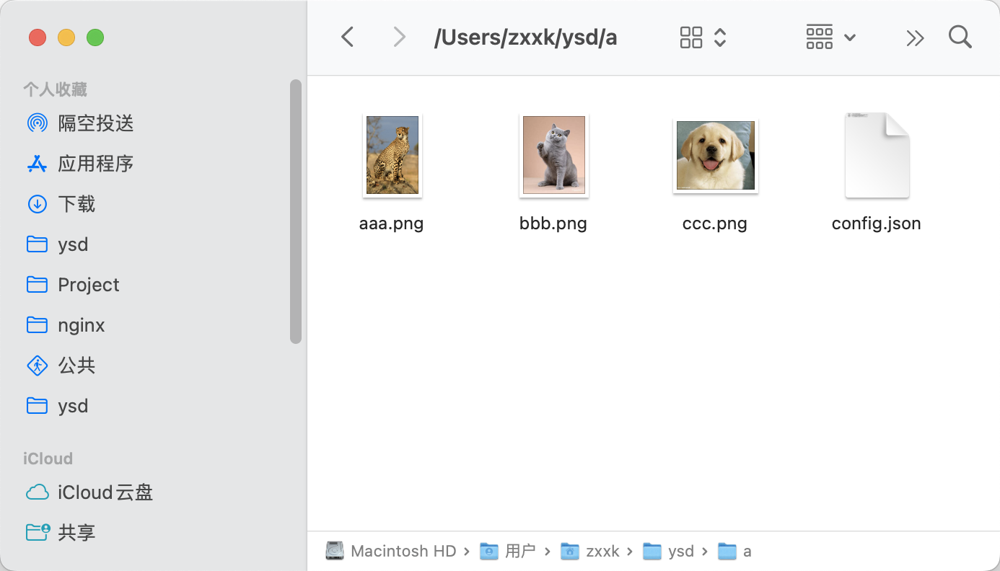
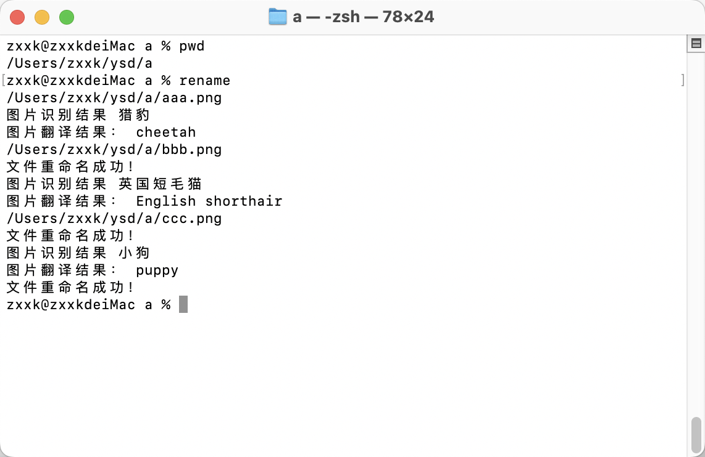
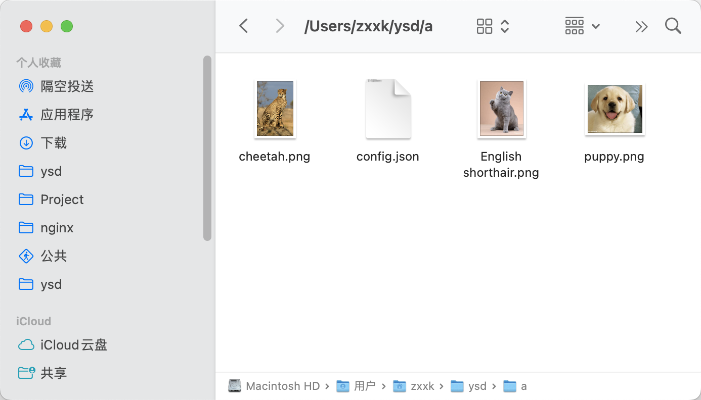

## renameimg-cli

图片重命名

将本地图片上传到百度通用图像识别，获得图像的中文释义，再通过有道翻译成英文，重新设置图片的名称。

### 安装

npm install renameimg-cli -g

### 使用

支持输入的图片格式：
```
['png', 'jpeg', 'jpg']
```
目录下需要有一个config.json文件。
```
https://cloud.baidu.com/
https://ai.youdao.com/

{
    "YDID": "有道智云应用id",
    "YDAK": "有道智云应用密钥",
    "BDAK": "百度智能云API Key",
    "BDSK": "百度智能云Secret Key"
}
```
#### 使用图片教程





#### 使用文字教程

在终端使用 rename 命令就可以。